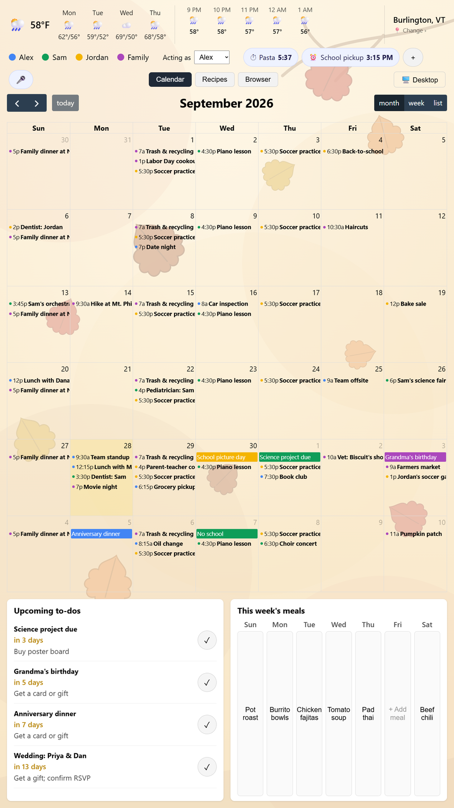
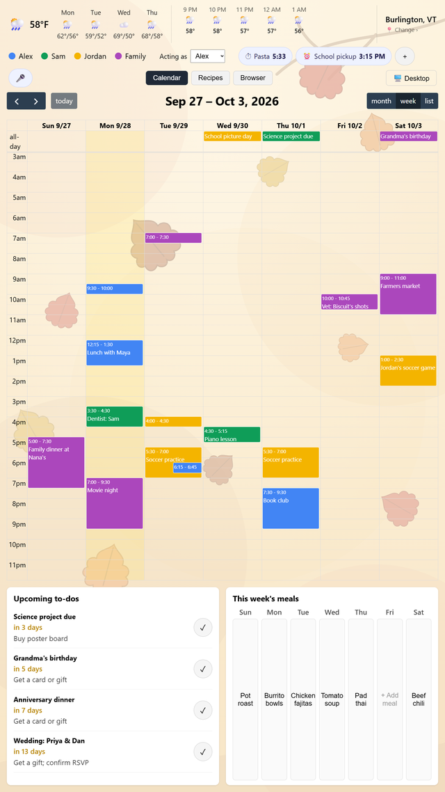
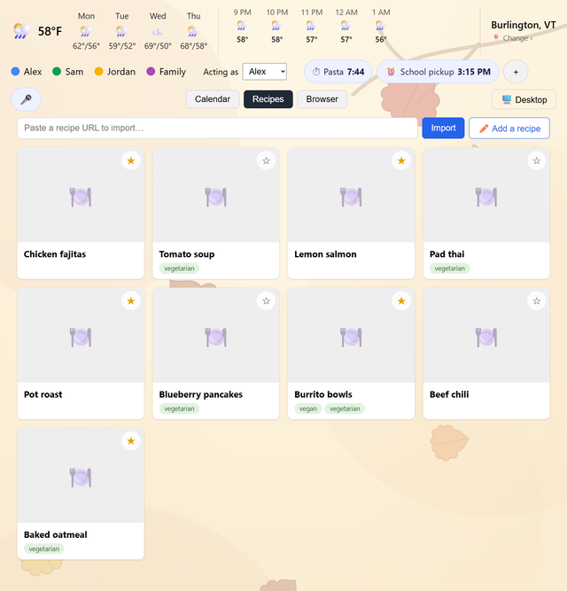
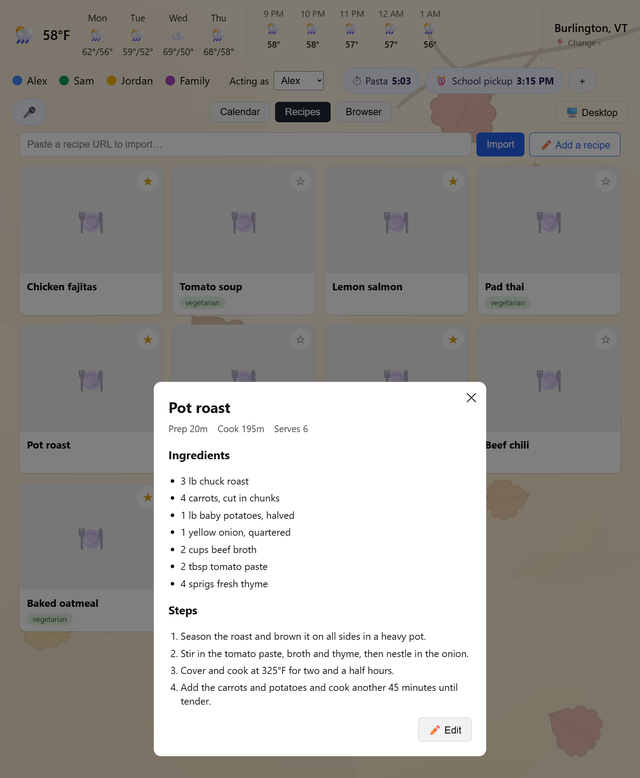
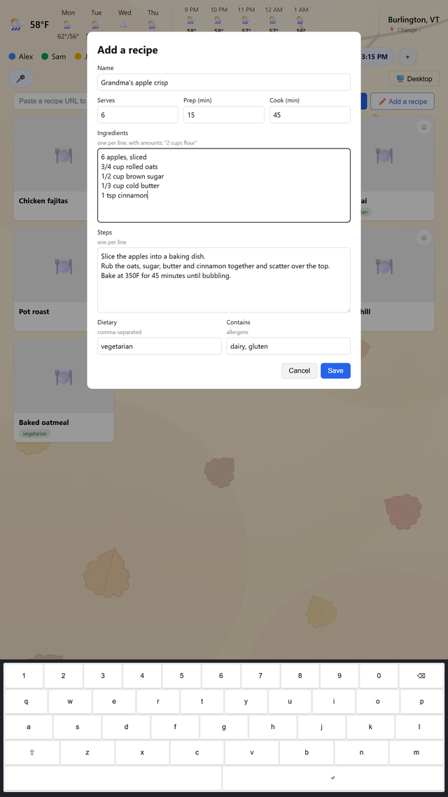
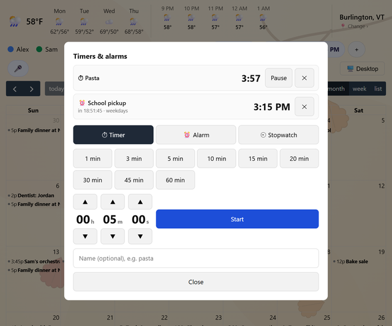
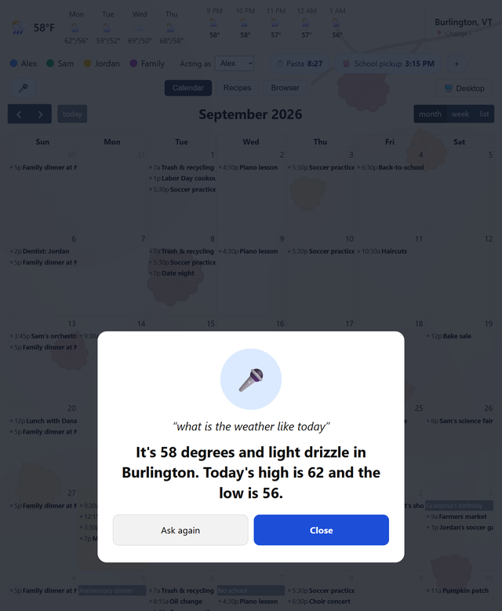

# Home Organizer

A wall-mounted kiosk for the whole household: a shared family calendar, recipes
and a weekly meal plan, kitchen timers, the weather, and a voice assistant you
talk to from across the room. It runs on a small PC behind a portrait
touchscreen, everything stays in the house unless you turn on the one optional
cloud feature, and it's yours to change.

<p align="center">
  
</p>

> The screenshots use made-up demo data (the fictional Rivera family), not a
> real household's calendar.

## What it does

**Calendar.** Syncs with Google Calendar (through OAuth), iCloud and any
CalDAV server. Each person gets a color; the month, week and list views show
everyone at once, and adding, editing or deleting an event on the wall writes
back to the real calendar. Recurring events, time zones and offline use are
handled: the screen keeps working from its local copy when the internet drops.
If a calendar stops syncing (an expired Google sign-in, say), a warning appears
on screen rather than the events quietly going stale.

**Prep reminders.** Birthdays, anniversaries and weddings surface an
"Upcoming to-dos" card ahead of time ("Grandma's birthday, in 5 days: get a
card or gift"). Any event can be flagged by hand, too.

**Recipes and meal plan.** Paste a link and it imports the recipe from
hundreds of sites, or type one in by hand. Each person has their own
favorites; ingredients are split into quantity and name, with dietary tags and
allergens, so a shopping list can be built from them later. A week planner puts
dinners on the calendar page.

**Timers, alarms and a stopwatch.** They tick in the header and ring through
the speakers whatever the screen is showing, and they survive restarts.

**Voice assistant.** Say "Hey Jarvis" and ask for a timer, the time, the
weather, or to restart the kiosk. The wake word, speech recognition
(faster-whisper) and spoken replies (Piper) all run on the machine itself.
Optionally, questions it can't answer with rules go to Claude as *text only*,
with web search if you allow it, and are answered aloud.

**Browser tab.** A real Chromium under the toolbar, for looking up recipes,
with one tap to add the page you're on.

**Ambient mode.** After a while untouched the screen turns into a photo
carousel and dims overnight; touch, or a voice command, brings it back.

### More screens

<table>
  <tr>
    <td align="center"><br>Week view, one color per person</td>
    <td align="center"><br>The recipe box, with favorites</td>
    <td align="center"><br>A recipe, with ingredients and steps</td>
  </tr>
  <tr>
    <td align="center"><br>Typing a recipe in, on the built-in keyboard</td>
    <td align="center"><br>Timers, alarms and stopwatch</td>
    <td align="center"><br>A voice exchange, shown on screen</td>
  </tr>
</table>

## How it's built

| | |
|---|---|
| Backend | Python 3.13, FastAPI, SQLModel on SQLite, Alembic migrations |
| Frontend | Svelte 5 and Vite, FullCalendar; built on the dev machine and served by the backend itself |
| Kiosk | Debian with XFCE, Chromium in kiosk mode, one systemd service for the backend |
| Calendars | CalDAV (Google through OAuth 2.0; iCloud and others with an app password) |
| Voice | openWakeWord, faster-whisper, Piper, all local; optional Claude API fallback |
| Weather | Open-Meteo (free, no key) |

The design leans on a few ideas:

- **The local database is the source of truth.** A background worker
  reconciles it with each calendar every few minutes, so pages never wait on
  the network and the wall keeps working through an outage.
- **Voice commands are plain functions** of `(text, context)`, tried in order,
  so they're easy to test with a fake clock and to extend.
- **One machine, one household.** The API listens only on `127.0.0.1`. Nothing
  is exposed to the network, and there are no user accounts to run.

```
backend/    FastAPI app: routers, models, calendar sync, voice pipeline, migrations, tests
frontend/   The Svelte page shown on the screen
deploy/     Setting up the kiosk: install steps, systemd units, the nightly backup
docs/       Privacy policy (published with GitHub Pages) and the screenshots above
PLAN.md     Design notes and the reasoning behind them
```

## The hardware it runs on

An x86-64 mini PC (Ryzen 5, 16 GB of RAM, NVMe) driving a 27" 2K touchscreen
mounted in portrait, with a USB microphone and the monitor's own speakers. It
was first planned for a Raspberry Pi; the mini PC made local speech
recognition practical, which is what let voice stay in the house.

## Try it

You don't need a kiosk to run it on a laptop.

```bash
# backend (Python 3.13)
cd backend
python -m venv .venv
source .venv/bin/activate          # Windows: .venv\Scripts\activate
pip install -r requirements-dev.txt
uvicorn app.main:app --reload --host 127.0.0.1 --port 8000

# frontend, in a second terminal (Node 22+)
cd frontend
npm install
npm run dev                        # http://localhost:5173, proxying /api to the backend
```

It creates its database and encryption key on first run. To show real events,
link a calendar; the steps for Google (a Cloud project with the Calendar and
CalDAV APIs enabled) are in [`backend/.env.example`](backend/.env.example).
Voice needs a microphone and a one-time model download
(`python -m app.voice.setup`); it is off until you turn it on.

Setting up the actual kiosk (Debian, touch rotation, the systemd service,
audio, screen sleep, backups) is covered step by step in
[`deploy/README.md`](deploy/README.md).

## Tests

```bash
cd backend && pytest        # calendar sync, recurrence, migrations, voice commands, the API
cd frontend && npm test     # the stores behind the timers, voice panel and sync warning
```

## Privacy

Calendar, recipes and meal plans live in a SQLite file on the kiosk, and
calendar sign-in tokens are stored encrypted with a key kept outside the
repository. Speech is turned into text on the machine. The only thing that
leaves the house on its own is what your calendars' own servers sync, and the
weather lookup for the town you pick. If you switch on the Claude fallback,
the *text* of a question it couldn't answer otherwise is sent to Anthropic with
the time, town and weather, and never calendar data or recipes. See the
[privacy policy](https://geoff-lucas.github.io/roll-your-own-home-assistant/privacy.html).

## Status

This is a personal project that runs in one home every day, not a packaged
product, so expect to read some code to set it up. What's next is a shopping
list built from the week's meal plan, more voice commands (reading the
calendar, adding events), and a phone app for browsing recipes. The reasoning
behind these choices, and what's been decided, is in [`PLAN.md`](PLAN.md).

## License

[BSD 3-Clause](LICENSE).
